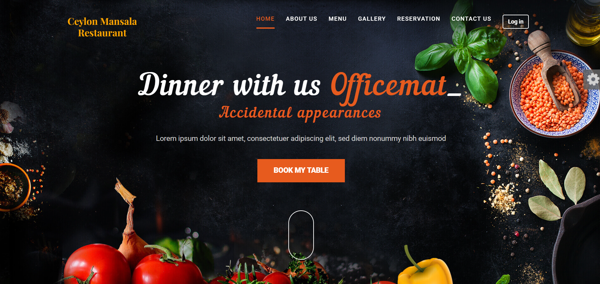

# 🍽️ Ceylon Mansala Food Restaurant

## 📌 Project Description

**Ceylon Mansala Food Restaurant** is a web-based Restaurant Management System designed to streamline day-to-day operations such as managing food menus, processing customer orders, handling reservations, and billing. The system enhances the dining experience for customers while making administrative tasks easier for restaurant staff and the owner.

This application is structured with a frontend interface for customer interaction and a backend dashboard for administrative control. It allows:

- Customers to browse the menu, place orders, and make reservations.
- Admin users to manage the menu, monitor orders, oversee reservations, and handle customer interactions.

---

## 📸 Screenshots

> _Add the actual image files in your project’s `assets/screenshots` folder and link them here._

### 🔹 Home Page


### 🔹 Admin Dashboard


### 🔹 Menu Management


### 🔹 Reservation Form


---

## 📽️ Demonstration Video

🎬 Watch the full demo here:  
👉 [https://youtu.be/FCrCBWz7lRo?si=YkBPwvexvonOFuNO](#)

---
🛠️ Technology Stack
---

##🔧 Backend

      ☕ Java 17 with Spring Boot.
      
      🔒 Spring Security with JWT Authentication.
      
      🗄️ Spring Data JPA.
      
      📊 MySQL Database.

##🎨 Frontend

      🌐 HTML5, CSS3, JavaScript.
      
      📱 Responsive Design for both mobile and desktop.
      
      🔄 jQuery for dynamic DOM manipulation and AJAX requests.

   ---

## ⚙️ Setup Instructions

Follow the steps below to install, configure, and run both the frontend and backend components of the project.

### 📁 Backend Setup

1. **Clone the repository**
   ```bash
   git clone https://github.com/your-username/ceylon-mansala-restaurant.git
   cd ceylon-mansala-restaurant/backend

2.Install dependencies.
   - npm install
    
3.Configure Environment.
   - Create a .env file and add required environment variables (e.g., DB connection strings, PORT).
    
4.Run the server.
   - npm start

---

🖥️ Frontend Setup

1.Navigate to the frontend directory
    cd ../frontend
    
2.Install dependencies
    npm install
    
3.Run the frontend app
    npm run dev

🤝 Contributing

Feel free to fork this repository and make contributions! Pull requests are welcome.


